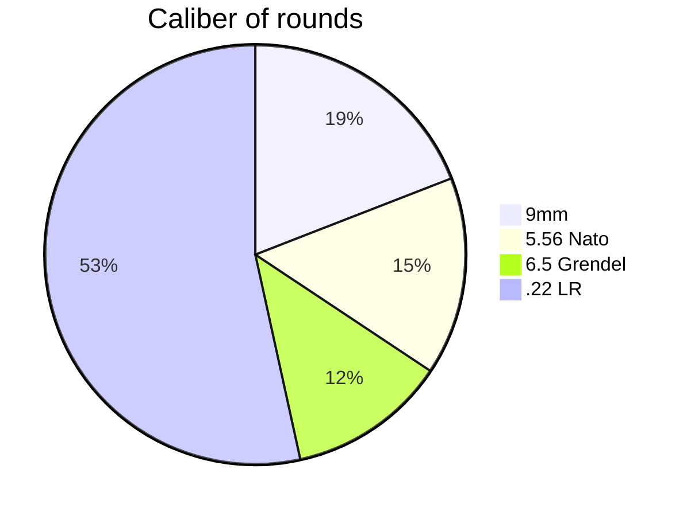

# -Diagram.md.
mermaid diagram

This pie chart is organizing the amount of ammo a local gun store my have on hand. This chart makes it simple to visualize the amount of ammo in the store as well as which ammo has the highest volume.  

